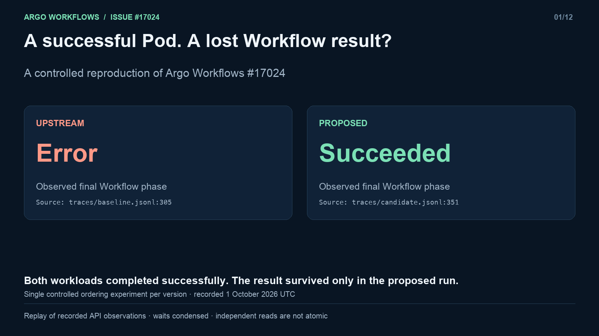

# A successful Pod, an incorrect Workflow result

**Argo Workflows #17024 — proposed capture-before-cleanup fix.** With status capture enabled, cleanup can remove an aged successful Pod before Workflow reconciliation persists its result. The next reconciliation can report `Error: pod deleted`. The proposed change connects persisted result/Pod identity, guarded cleanup and restart recovery.

This is a local review package for a proposed patch, not an upstream release. The original issue and reproduction are by [@jalvarezz13](https://github.com/argoproj/argo-workflows/issues/17024). The prepared contribution is by Ruslan Shaydullin, with AI assistance disclosed in the [PR description](pr-description.md).

## Choose your review depth

| Time | Start here | What to look for |
|---|---|---|
| 30 seconds | The outcome table below | Successful workload, different recorded Workflow result |
| 2½ minutes | [Captioned demo](demo.mp4) · [text transcript](transcript.md) | Real observed states, original Pod UID and cleanup |
| 5 minutes | [Review guide](reviewer-guide.md) | Why persistence, cleanup and recovery belong together; explicit costs and compatibility |
| Detailed review | [Reproduce](reproduction.md) · [patch](argo-17024.patch) · [diff map](diff-map.json) | Run the discriminator, follow code paths and inspect tests |

## What the fresh runs observed

| Observation | Upstream | Proposed |
|---|---|---|
| Original workload Pod | Succeeded; init/main/wait exit 0 | Succeeded; init/main/wait exit 0 |
| While Workflow reconciliation is delayed | Pod disappears; Workflow node still Running | Original UID and status finalizer remain; node still Running |
| After normal Workflow workers resume | Error, message `pod deleted` | Succeeded, synchronized task state, captured UID matches original |
| Final Pod state | Absent | Absent; cleanup completed |

Two independent namespaced runs used the same reproducer, executor and workload, with the candidate CRD installed for both controller versions. The recording was made on 2 October 2026 in UTC+05; exact UTC timestamps are in the traces. Zero Workflow workers deliberately controls the ordering. This demonstrates the defect and the proposed outcome, not failure frequency or production performance.

**How to read the video:** it is a rendered replay of recorded API observations, with waiting periods condensed and the two runs aligned by experiment phase. Each read has its own timestamp. No intermediate frame of “result saved while Pod still exists” was captured: the next candidate observation already shows both the saved result and an absent Pod. The protocol diagram is labelled as design; it is not presented as another observation.

## Reproduce and inspect

- [Build and run instructions](reproduction.md) and the unchanged [Python reproducer](reproduce.py).
- [Full upstream observations](traces/baseline.jsonl) and [full candidate observations](traces/candidate.jsonl): 310 and 355 read cycles, respectively. Each object read has its own timestamp and resource version.
- [Run summary](run-summary.json), [observation audit](evidence/observation-audit.json), and [video scene references](scenes.json).
- [Costs](costs.md), including [213 measured scenario rows](evidence/cost-comparison.json); these earlier measurements were not rerun for the video.
- [Validation scope](validation.md): fresh demonstration, prior checks, applicability and unrun checks.

The package contains only public-safe observation projections. Raw API responses, complete command output, kubeconfig and credentials are not included. Raw hashes are retained as provenance identifiers; independent reproduction is the way to verify the behavior.

## Tradeoffs that remain

The finalizer is opt-in, but common cleanup reads and UID recording also run with the flag off. Unsupported completed legacy graphs—including an ordinary successful two-step Workflow—remain held. Retained encoded backlogs repeat whole-map hydration. Preserving outstanding obligations during upgrade/rollback requires the documented CRD/old-writer procedure. These are part of the proposed contract and remain review questions.

The video does not establish offload, crash or all lifecycle guarantees; those require the separate tests and review paths in the guide. Remote CI and production throughput remain unmeasured.

## Candidate identity

- Upstream base: `dadd69141c570fa678f7d51ee6decfe3fa77f109`.
- Proposed source set: `50a6b953587fbf7eccdc6c61f0d7a0db1fcae87c699293104d6ed6298b6d60fd`.
- Patch SHA-256: `aeba17d588a6fb9434f4d66eeaa72bdc20313a895e6a7eb3476dd2f9c6d11614`.
- [Manifest](manifest.json) and [checksums](SHA256SUMS) identify this presentation package. From the extracted directory, run `shasum -a 256 -c SHA256SUMS`.

All links resolve inside the extracted package except the explicitly linked upstream issue/project pages. No public upload, PR or maintainer approval is implied.
